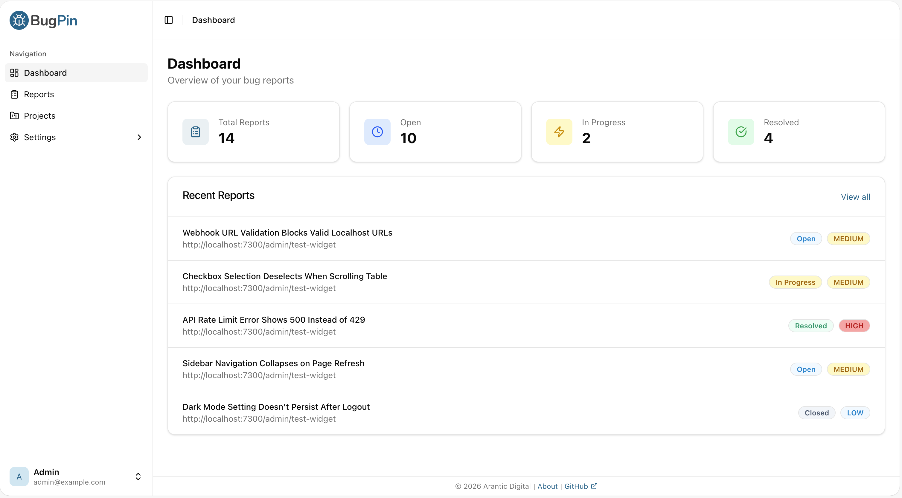
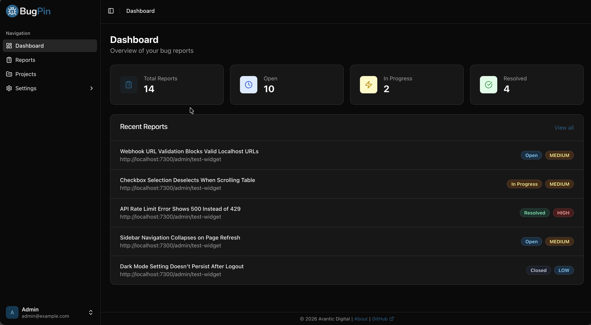

<div align="center">
    <picture>
        <source media="(prefers-color-scheme: dark)" srcset="src/admin/public/branding/dark/logo-dark.svg" />
        
    </picture><br /><br />
    <p><big><strong>The self-hosted, open-source visual bug reporting tool.</strong></big><br />
    Capture screenshots, annotate issues, and track bugs from your web applications.</p>
    <!-- <a target="_blank" href="https://github.com/aranticlabs/bugpin"></a> -->
    <a target="_blank" href="https://github.com/aranticlabs/bugpin"></a>
    <a target="_blank" href="https://github.com/aranticlabs/bugpin/blob/main/LICENCE"></a>
</div>
<br />

Dashboard — manage projects and triage reports in one place.

_Light Mode_


_Dark Mode_


# Features

- **Visual Bug Reporting** - Capture screenshots with one click
- **Annotation Tools** - Draw, highlight, and annotate screenshots
- **Offline Support** - Reports are buffered and sent when back online
- **Self-Hosted** - Your data stays on your servers
- **Multi-Project** - Manage multiple projects with separate API keys
- **Enhanced Security Features** - Domain whitelists, configurable rate limiting, HSTS, and secure headers
- **GitHub Integration** - Forward reports to GitHub Issues
- **Dark Mode** - Admin Console supports light and dark themes

# Quick Start

Get BugPin up and running in under 1 minute. This guide will walk you through the basic setup to start capturing and managing bug reports.

## Install

### Docker Compose

Create a `docker-compose.yml` file:

```yaml
services:
  bugpin:
    image: registry.arantic.cloud/bugpin/bugpin:latest
    container_name: bugpin
    restart: unless-stopped
    ports:
      - '7300:7300'
    volumes:
      - ./data:/data
```

Then run:

```bash
# Start BugPin
docker compose up -d
```

### Docker Run

```bash
# Run BugPin container
docker run -d \
  --name bugpin \
  --restart unless-stopped \
  -p 7300:7300 \
  -v bugpin-data:/data \
  registry.arantic.cloud/bugpin/bugpin:latest
```

BugPin will be available at `http://localhost:7300`

## Login

Log in with the default credentials:

- **Email**: `admin@example.com`
- **Password**: `changeme123`

> [!IMPORTANT]
> Change the default password immediately after first login:
>
> 1. Click your profile icon
> 2. Select "Profile"
> 3. Update your password

## Widget Integration

Add the BugPin widget to your website by including this script tag before the closing `</body>` tag:

```html
<!-- Start of BugPin Widget -->
<script src="http://localhost:7300/widget.js" data-api-key="YOUR_API_KEY"></script>
<!-- End of BugPin Widget -->
```

## Full Documentation

Full documentation is available at [docs.bugpin.io](https://docs.bugpin.io):

- [Docker Installation](https://docs.bugpin.io/installation/docker)
- [Bun Installation](https://docs.bugpin.io/installation/bun)
- [Reverse Proxy](https://docs.bugpin.io/installation/reverse-proxy)
- [Configuration](https://docs.bugpin.io/configuration/server)
- [Widget Installation](https://docs.bugpin.io/widget/installation)
- [GitHub Integration](https://docs.bugpin.io/integrations/github)
- [API Reference](https://docs.bugpin.io/api/overview)
- [Security](https://docs.bugpin.io/security/settings)

## Tech Stack

- **Server**: Bun, Hono, SQLite
- **Admin Console**: React, TanStack Query, Tailwind CSS
- **Widget**: Preact, Fabric.js, Shadow DOM

## Support

- [GitHub Issues](https://github.com/aranticlabs/bugpin/issues) - Bug reports and feature requests
- [Documentation](https://docs.bugpin.io) - Guides and reference

## Contributing

Contributions are welcome! Please read [CONTRIBUTING.md](CONTRIBUTING.md) before submitting pull requests.

## License

BugPin uses a multi-license approach:

- **Server & Admin Console**: [AGPL-3.0](LICENCE)
- **Widget**: [MIT](https://github.com/aranticlabs/bugpin/blob/main/src/widget/LICENSE)
